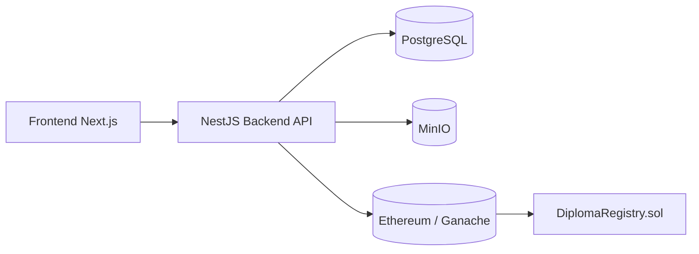

# Diploma Verification Platform (Blockchain)

Полный monorepo-проект для загрузки, согласования и верификации дипломов с фиксацией этапов в блокчейне.

## 1) Структура проекта

```text
new_diplom/
  backend/                 # NestJS API
  frontend/                # Next.js UI
  contracts/               # Hardhat + Solidity
  docker-compose.yml
  .env.example
```

## 2) Архитектура



## 3) Реализованные модули

- Загрузка PDF + метаданных студента.
- Вычисление SHA-256 хэша для контроля целостности.
- Хранение PDF в MinIO.
- State machine этапов:
  - `UPLOADED`
  - `UNDER_REVIEW`
  - `APPROVED_DEPARTMENT`
  - `APPROVED_DEAN`
  - `REGISTERED`
- Логирование этапов в смарт-контракте (`logEvent`).
- Финальная регистрация (`registerDocument`).
- Проверка (`verifyDocument`) + QR URL.
- JWT авторизация и роли: `ADMIN`, `REVIEWER`, `USER`.
- AI аудит-заглушка `aiCheck`.

## 4) База данных

Таблицы (TypeORM entities):
- `users`
- `documents`
- `approvals`
- `audit_logs`

## 5) Docker Compose (обязательно)

Поднимаются сервисы:
- `frontend` (localhost:3000)
- `backend` (localhost:5000)
- `postgres` (localhost:5432)
- `minio` (localhost:9000, console localhost:9001)
- `blockchain` (localhost:8545)

Есть:
- healthcheck для сервисов
- volumes для постоянного хранения данных
- авто-создание MinIO bucket через `minio-init`

## 6) Пошаговый запуск

1. Установите Docker Desktop:
   https://www.docker.com/products/docker-desktop/

2. Создайте `.env` из шаблона:

```bash
cp .env.example .env
```

3. Поднимите систему:

```bash
docker-compose up --build
```

4. Откройте:
- Frontend: http://localhost:3000
- Backend: http://localhost:5000
- MinIO Console: http://localhost:9001
- Blockchain RPC: http://localhost:8545

## 7) Развертывание контракта (Hardhat)

После старта `blockchain`, в отдельном терминале:

```bash
cd contracts
npm install
npm run compile
npm run deploy:local
```

Скопируйте адрес контракта в `.env`:

```env
BLOCKCHAIN_CONTRACT_ADDRESS=0x...
```

И перезапустите backend:

```bash
docker-compose restart backend
```
